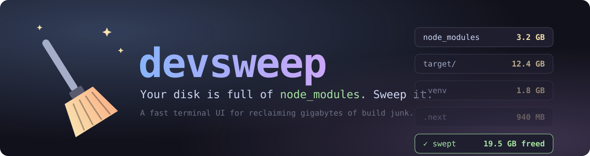
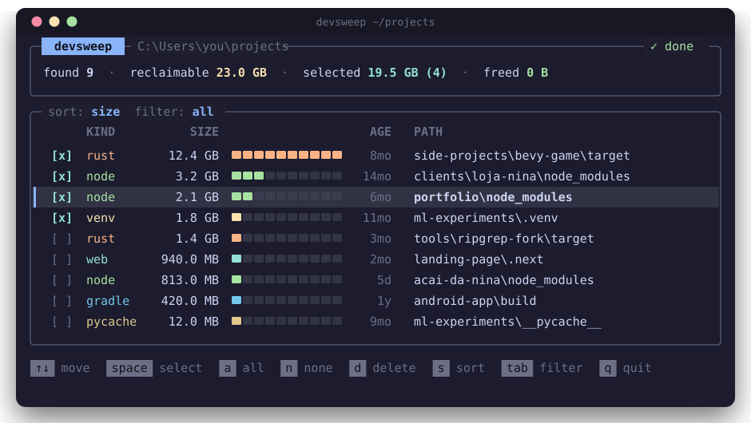
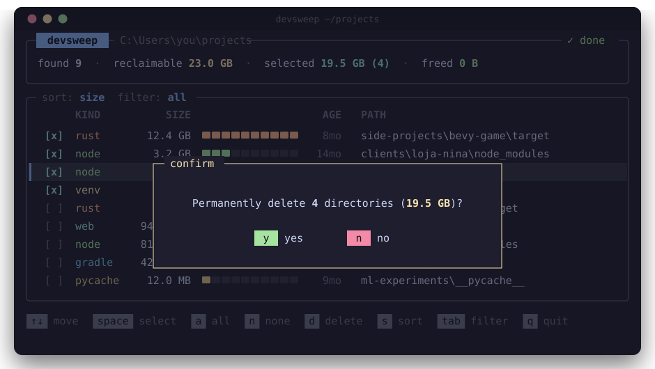

<p align="center">
  
</p>

<p align="center">
  <a href="https://github.com/Polar123321/devsweep/actions/workflows/ci.yml"></a>
  <a href="LICENSE"></a>
  
  
</p>

<p align="center">
  <b>Your disk is full of <code>node_modules</code>. Sweep it in seconds.</b><br>
  A fast, cross-platform terminal UI that finds and deletes regenerable build junk<br>
  across every project on your machine.
</p>

<p align="center">
  
</p>

## Why

Every dev machine slowly fills with `node_modules`, Rust `target/` folders, Python virtualenvs and
framework caches from projects you haven't touched in months. Finding them by hand is tedious;
`rm -rf`-ing the wrong folder is worse.

`devsweep` scans a directory tree in parallel, shows you exactly what is reclaimable, and lets you
pick what to delete, all from a keyboard-driven TUI.

## Features

- **Fast**: parallel directory walk and size measurement (built on `rayon`); results stream in live.
- **Safe by design**
  - `target/` and `build/` are only flagged when a sibling `Cargo.toml`, `pom.xml` or `build.gradle`
    proves they are build output. A random folder named `target` is left alone.
  - Never descends into `.git`, `AppData`, `Library`, `.cargo`, `.vscode` and similar, where a
    `node_modules` is part of an installed program.
  - Symlinks are never followed or deleted, and every path is re-validated right before removal.
  - Always asks for confirmation, and has `--dry-run`.
- **Multi-ecosystem**: Node, Rust, Python, Web frameworks, Maven, Gradle, CocoaPods.
- **Stale-only mode**: `--older-than 90` shows only projects you haven't touched in 90 days.
- **Scriptable**: `--list` prints results and exits.

<p align="center">
  
</p>

## What it detects

| Kind      | Directory                                                        | Detected when                          |
| --------- | ---------------------------------------------------------------- | -------------------------------------- |
| `node`    | `node_modules`                                                   | always                                 |
| `rust`    | `target`                                                         | sibling `Cargo.toml`                   |
| `venv`    | `.venv`, `venv`, `env`                                           | contains `pyvenv.cfg`                  |
| `pycache` | `__pycache__`                                                    | always                                 |
| `web`     | `.next`, `.nuxt`, `.svelte-kit`, `.turbo`, `.parcel-cache`, `.angular` | sibling `package.json`           |
| `maven`   | `target`                                                         | sibling `pom.xml`                      |
| `gradle`  | `build`, `.gradle`                                               | sibling `build.gradle(.kts)`           |
| `pods`    | `Pods`                                                           | sibling `Podfile`                      |

## Install

From source (needs a recent Rust toolchain):

```sh
cargo install --git https://github.com/Polar123321/devsweep
```

Or grab a prebuilt binary from the [Releases](../../releases) page.

## Usage

```sh
devsweep                    # scan the current directory
devsweep ~/projects         # scan a specific directory
devsweep --older-than 90    # only projects untouched for 90+ days
devsweep --dry-run          # try it without deleting anything
devsweep --list ~/projects  # plain-text report, no TUI
```

### Keys

| Key                   | Action                                        |
| --------------------- | --------------------------------------------- |
| `↑` `↓` / `j` `k`     | Move                                          |
| `PgUp` `PgDn`         | Move by 10                                    |
| `g` / `G`             | Jump to top / bottom                          |
| `Space`               | Select / unselect                             |
| `a` / `n`             | Select all visible / clear selection          |
| `s`                   | Cycle sort: size, age, path                   |
| `Tab`                 | Cycle filter by kind                          |
| `d` / `Enter`         | Delete selected (or the current row)          |
| `y` / `n`             | Confirm / cancel in the dialog                |
| `q` / `Esc`           | Quit                                          |

## Roadmap

- [ ] Config file for custom rules
- [ ] Docker build-cache and image cleanup
- [ ] Move to trash instead of permanent delete
- [ ] Homebrew / Scoop / winget packages

## Development

```sh
cargo test
cargo clippy --all-targets -- -D warnings
```

To record a real demo GIF: install [vhs](https://github.com/charmbracelet/vhs) and run `vhs demo.tape`.

## License

MIT
